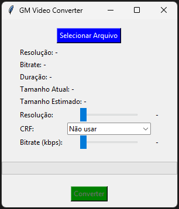
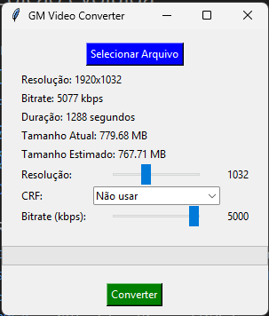

# GM Video Converter

## Sobre o Projeto
O **GM Video Converter** é a solução ideal para quem busca uma ferramenta prática para ajustar a qualidade e o tamanho de seus vídeos de maneira rápida e eficiente. Com uma interface simples, ele permite selecionar o arquivo, configurar as preferências e converter vídeos em poucos cliques.

## Funcionalidades Principais
- **Seleção de Arquivo**: Permite escolher o vídeo a ser convertido diretamente pela interface.
- **Ajuste de Resolução**: Controle deslizante para definir a resolução final do vídeo.
- **Taxa de Bits (Bitrate)**: Ajustável para maior controle do tamanho do arquivo e qualidade.
- **Fator de Qualidade Constante (CRF)**: Configurável via menu suspenso, com a opção de desativar.
- **Cálculo do Tamanho Estimado**: Exibe o tamanho estimado do arquivo convertido em tempo real.
- **Barra de Progresso**: Indica o progresso da conversão.
- **Saída Organizada**: Arquivos convertidos são salvos na pasta `output` com nomes detalhados.

## Como Usar
### Tela Inicial


1. **Selecione um arquivo de vídeo**:
   - Clique no botão `Selecionar Arquivo` e escolha o vídeo desejado.

### Tela com Arquivo Selecionado


2. **Configure as opções de conversão**:
   - Ajuste a resolução usando o slider.
   - Escolha um valor de CRF no menu suspenso ou ajuste o bitrate manualmente (se o CRF estiver desativado).

3. **Inicie a conversão**:
   - Clique no botão `Converter`. O progresso será exibido na barra de progresso.

4. **Verifique a saída**:
   - O vídeo convertido será salvo na pasta `output` com um nome detalhado que inclui as configurações aplicadas.

## Requisitos
- Python 3.7+
- Dependências listadas no arquivo `requirements.txt`

## Instalação
1. Clone o repositório:
   ```bash
   git clone https://github.com/seu-usuario/gm-video-converter.git
   ```
2. Instale as dependências:
   ```bash
   pip install -r requirements.txt
   ```

## Formatos Suportados
- MP4
- MOV
- MKV
- AVI

## Detalhes Técnicos
- **Bibliotecas Utilizadas**:
  - `tkinter`: Interface gráfica.
  - `subprocess`: Execução de comandos FFmpeg encapsulados pelo `imageio_ffmpeg`.
  - `imageio_ffmpeg`: Fornece e encapsula o executável do FFmpeg no ambiente Python.
  - `threading`: Execução assíncrona do processo de conversão.

## Exemplos de Uso
### Conversão com CRF
- Resolução: 1080p
- CRF: 23
- Nome de saída: `video_res-1080_crf-23_20240101_120000.mp4`

### Conversão com Bitrate
- Resolução: 720p
- Bitrate: 2000kbps
- Nome de saída: `video_res-720_crf-2000k_20240101_120000.mp4`

## Contribuição
Contribuições são bem-vindas! Sinta-se à vontade para abrir issues ou enviar pull requests.

## Licença
Este projeto está licenciado sob a licença MIT. Consulte o arquivo LICENSE para mais detalhes.

